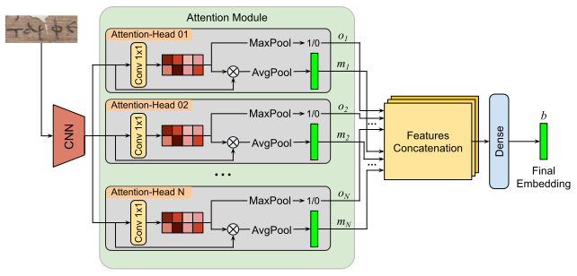

# NeuroPapyri

# Preparate Enviroment
You must have the [conda](https://conda.io/projects/conda/en/latest/index.html) package manager installed.

You can create an environment with the command:
```console
conda env create -f environment.yml
```
Now, you can activate the environment with the command:
```console
conda activate neuropapyri
```
# Download Data
as first step, you need to download all the datasets.
You can download automatically the dataset by running the script:
```console
pyhton 00_download_data.py
```

Alternativelly, you can download the dataset direcly form the competition link:

- [https://lme.tf.fau.de/competitions/2023-competition-on-detection-and-recognition-of-greek-letters-on-papyri/](https://lme.tf.fau.de/competitions/2023-competition-on-detection-and-recognition-of-greek-letters-on-papyri/)\
*You need to download only the trining set, because it is the only available with full annotations

- [https://data.cs.mtsu.edu/al-pub/](https://data.cs.mtsu.edu/al-pub/)

- Run the scripts to generate the datasets manually


# Character Identification

### Train
To train the NeuroPapyri for character identification tou can use these two command for the two datasets: \
(if you need, change all the parameters!)

ALPUB_V:
```console
src/01_train_ci.py --data_path data/ALPUBV2_lines_01 --output_save output/ci/alpubv --split_train 0.9 --resize_height 492 --resize_width 1232 --padding_transcription 10 --step 2 --lr 0.0001 --batch_size 4 --epochs 20
```

ICDAR23:
```console
src/01_train_ci.py --data_path data/ICDAR_lines_01 --output_save output/ci/icdar --split_train 0.9 --resize_height 492 --resize_width 1232 --padding_transcription 10 --step 2 --lr 0.0001 --batch_size 4 --epochs 20
```

### Test
To test one model, you can run the following command:
```console
src/02_test_ci.py --model MODEL_TO_TEST --output_save output/OUTPUT_FOLDER --resize_height 492 --resize_width 1232 --padding_transcription 10
```

# Document Retrieval
We can train NeuroPapyri for document retrieval in two different modalities: without attention loss and wit attention loss.

### Train
#### No Attention Loss
Training without asttention loss:
```console
src/03_train_dr.py --data_path data/ICDAR_lines_02 --output_save output/OUTPUT_FOLDER --batch_size 64 --lr 0.0001 --epochs 50 --save_epochs 5
```

#### Attention Loss
Training with asttention loss:
```console
src/04_train_dr.py --data_path data/ICDAR_lines_02 --output_save output/OUTPUT_FOLDER --batch_size 64 --lr 0.0001 --epochs 50 --save_epochs 5
```

### Test
```console
python src/05_test_dr.py --models LIST_OF_MODELS_TO_TEST
```


> **_NOTE:_** \
You can resume a previously interrupted training using the `--continue_training_model` parameter to pass the last model from which to resume the training process

